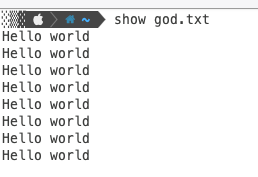

# Show
**Practice project**

Show is a simple CLI command written in Go that functions as an alternative to the `cat` command. It reads and displays the contents of a file in the terminal.


## Screenshot



## Usage

Run the following command to display the contents of a file:
```sh
show filename.txt
```
If no filename is provided, the program will return an error message.

## Example Output
```
$ show example.txt
Hello, World!
This is a test file.
```


